[](https://confluence.jetbrains.com/display/ALL/JetBrains+on+GitHub)

⚠️ **This repository is no longer actively maintained.** ⚠️ 

Active Skija project is located at [HumbleUI/Skija](https://github.com/HumbleUI/Skija/)

# Skija: Java bindings for Skia

**Skia** is an open source 2D graphics library which provides common APIs that work across a variety of hardware and software platforms.

**Skija** is a high-quality Java bindings for Skia.

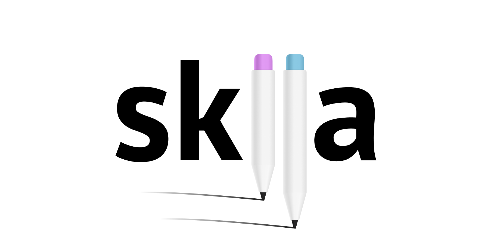


## Motivation: Why Skija?

Because Java doesn’t have a powerful and modern 2D graphics — still!

There are many occasions when you might need graphics:

- custom UI widget libraries and whole toolkits,
- graphs, diagrams,
- visualizations,
- games.

Existing offerings are: Graphics2D from AWT, GraphicsContext from JavaFX. They are good, but underwhelming.

Enter Skia. Skia has a proven track record of industrial-scale project relying on it for all things graphics: Google Chrome, Android, Flutter, Firefox Canvas, Xamarin, LibreOffice. Skia outperforms all existing Java2D toolkits in almost every benchmark, and also provides:

- extensive color spaces support,
- modern typography with open type features, variable typefaces, correct multi-script text handling, emojis,
- highly-optimized GPU rendering,
- modern GPU backends, including Vulkan and Metal (already in Skia, coming to Skija soon),
- built-in caching and compositing facilities.

Skija brings all this power to the tips of your fingers, as simple as adding a jar to classpath.

## Why hand-crafted bindings?

Automatically generated bindings for Skia exist, but don’t seem to have high adoption:

- [github.com/bytedeco/javacpp-presets/tree/master/skia](https://github.com/bytedeco/javacpp-presets/tree/master/skia)
- [github.com/eungju/skia-javacpp](https://github.com/eungju/skia-javacpp)

Skija project has a goal of providing great Java-native API that is natural to use. In particular:

- full automatic memory management, no pointer abstractions leaking,
- natural use of Java classes, interfaces, inheritance, singletons,
- consistent naming following Java conventions, including getters/setters for properties,
- typed enums instead of integer constants,
- native Java platform abstractions instead of wrapped Skia/C++ ones (strings, arrays, streams, files, byte buffers, AutoCloseable),
- hiding implementation details, e.g. transparent string encoding conversion, byte/code point indices conversion,
- fluent builder-style APIs where possible,
- lightweight data classes where possible (Point, Rect, FontMetrics, etc are not mirrored by native instances).

The ultimate goal for Skija is to feel as a Java library and not having to think about native part at all.

## Built with Skija

[Compose for Desktop](https://www.jetbrains.com/lp/compose/), declarative UI toolkit for Kotlin:

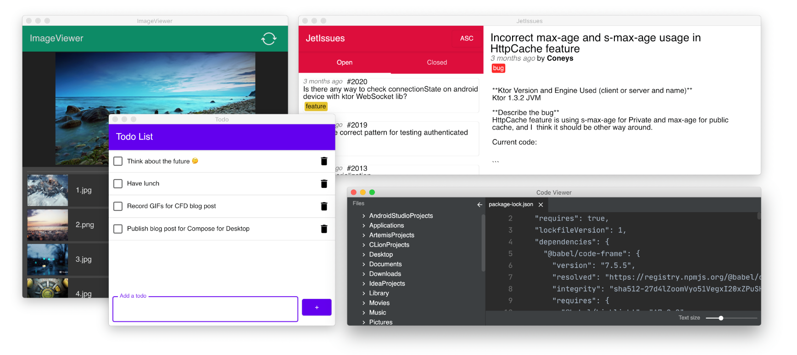

[Skija Graphics2D](https://github.com/jfree/skijagraphics2d/), an implementation of Java2D API:

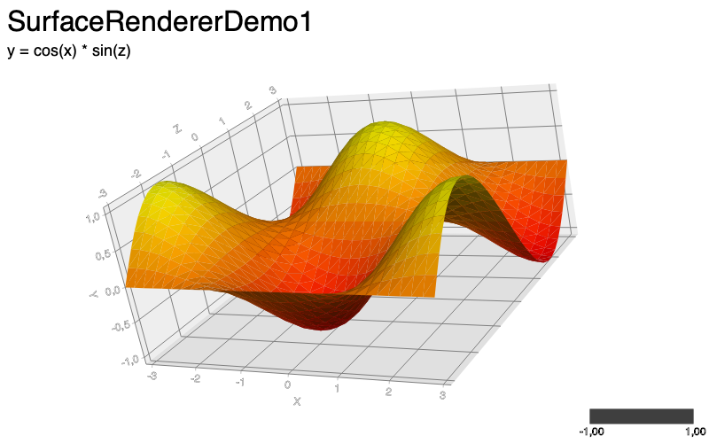

[Robert Felker](https://twitter.com/BlueAquilae/status/1322696020329902082) demos:

|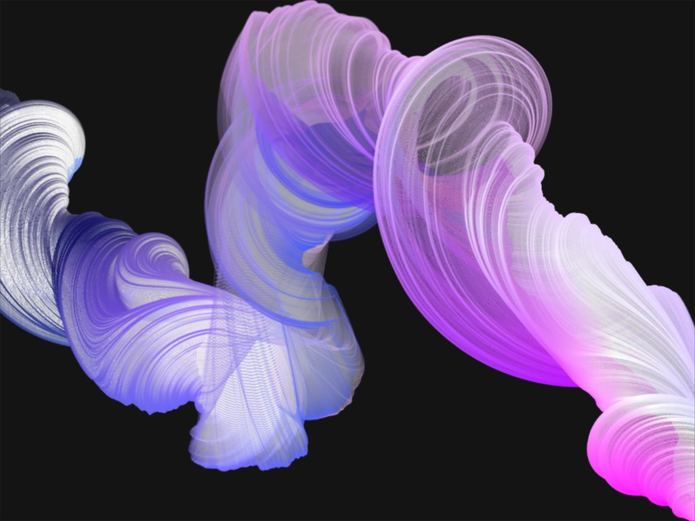|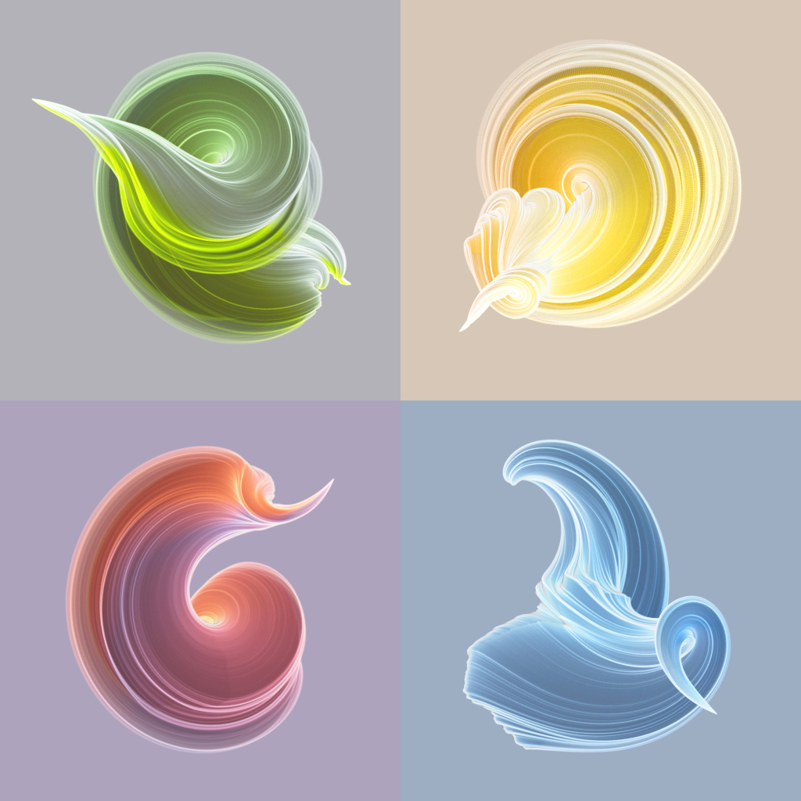|
|---|---|
|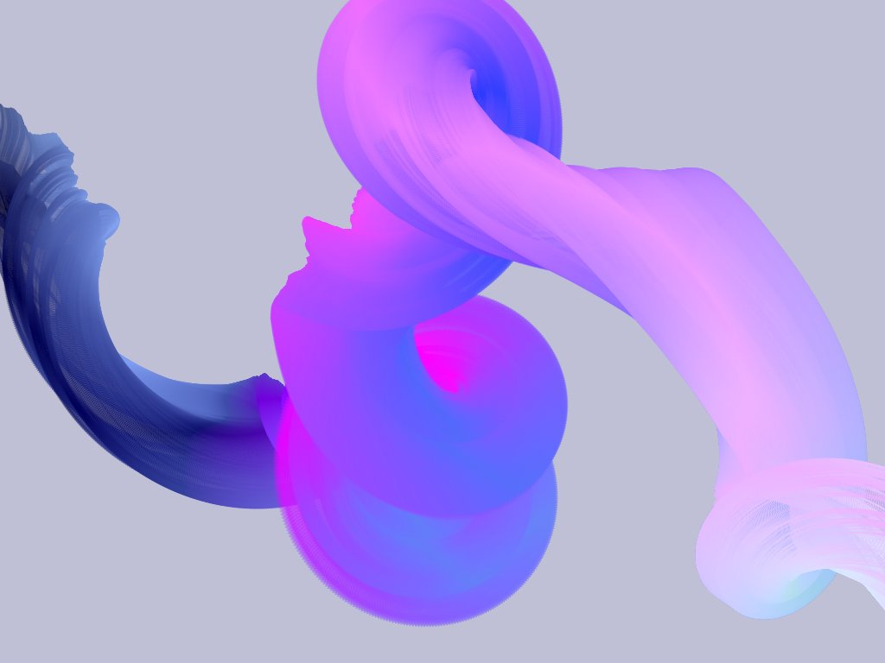|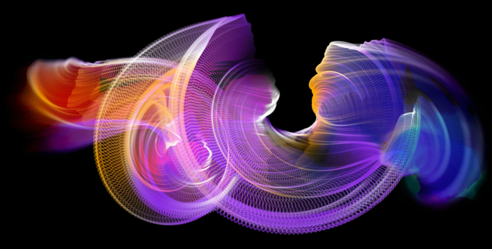|

[Harold](https://www.instagram.com/_hrrld/) videos:


[Skija demo app](examples/lwjgl):

|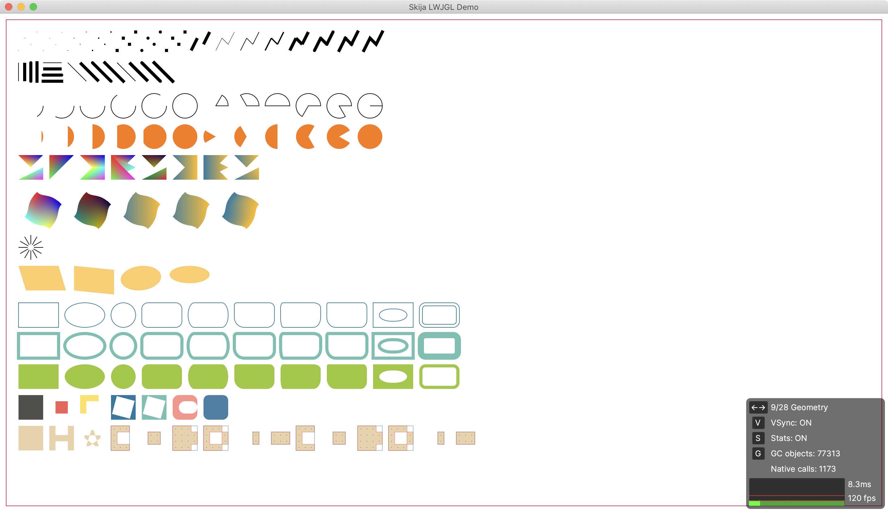|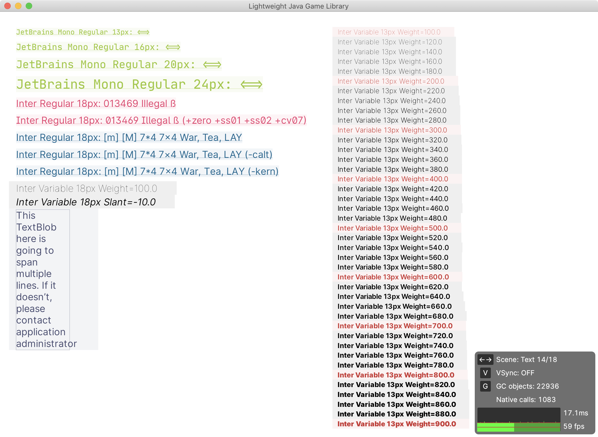|
|---|---|
|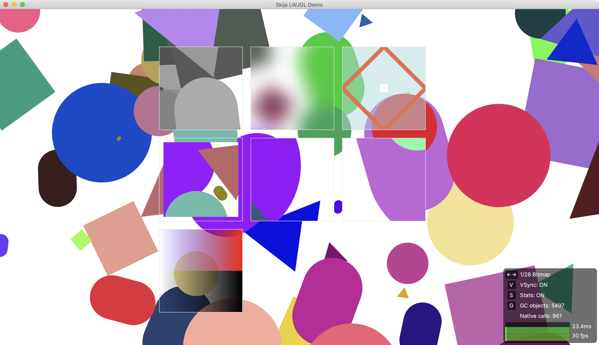|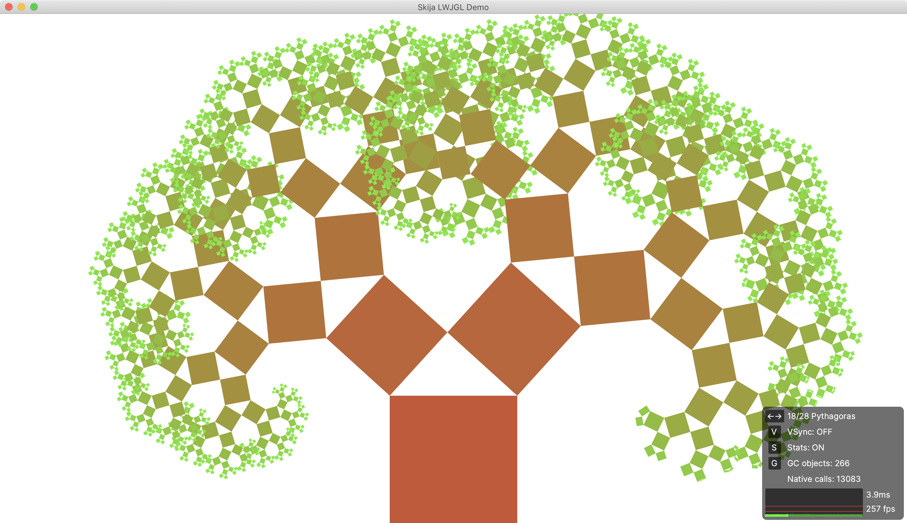|
|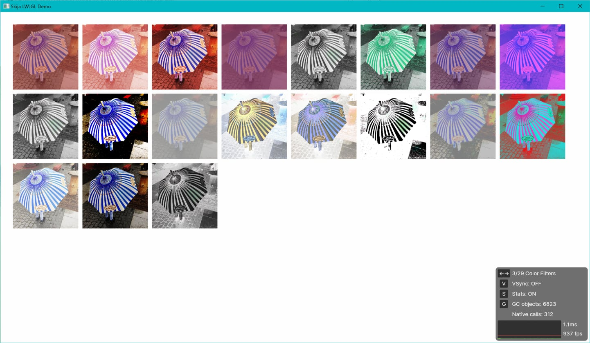|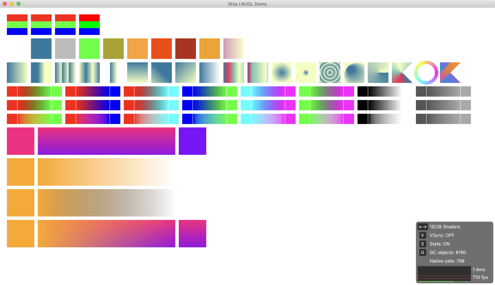|

## Current status

Public alpha. Things might change without notice.

Please note that Skia is known to change its API quite often (monthly). Skija will do its best to protect from these changes, but sometimes it might be impossible (e.g. method was removed). Normally it’s auxiliary stuff though, don’t worry too much.

Platforms:

- [x] Windows
- [x] Linux
- [x] macOS

Backends:

- [x] Bitmap
- [x] OpenGL
- [x] Direct3D
- [x] Metal
- [ ] Vulkan

APIs:

```
Bitmap               ▓▓▓▓▓▓▓▓▓▓    Paint                ▓▓▓▓▓▓▓▓▓▓
Canvas               ▓▓▓▓▓▓▓▓░░    Path                 ▓▓▓▓▓▓▓▓▓▓
Codec                ▓▓▓▓░░░░░░    PathEffects          ▓▓▓▓▓▓▓▓▓▓
Color                ▓░░░░░░░░░    PathMeasure          ▓▓▓▓▓▓▓▓▓▓
ColorFilter          ▓▓▓▓▓▓▓▓▓▓    PaintFilterCanvas    ▓▓▓▓▓▓▓▓▓▓
ColorInfo            ▓▓▓▓▓▓▓▓▓▓    Picture              ▓▓▓▓▓▓▓▓▓░
ColorSpace           ▓▓▓▓░░░░░░    PictureRecorder      ▓▓▓▓▓▓▓▓▓▓
Data                 ▓▓▓▓▓▓▓▓▓░    PixelRef             ▓▓▓▓▓▓▓▓▓▓
Drawable             ▓▓▓▓▓▓▓▓░░    Pixmap               ▓▓▓▓▓▓▓▓▓▓
Flattenable          ░░░░░░░░░░    Region               ▓▓▓▓▓▓▓▓▓▓
Font                 ▓▓▓▓▓▓▓▓▓▓    RuntimeEffect        ▓▓▓▓▓░░░░░
FontData             ░░░░░░░░░░    ScalerContext        ░░░░░░░░░░
FontManager          ▓▓▓▓▓▓▓▓▓░    Shader               ▓▓▓▓▓▓▓▓▓▓
FontStyle            ▓▓▓▓▓▓▓▓▓▓    ShadowUtils          ▓▓▓▓▓▓▓▓▓▓
FontStyleSet         ▓▓▓▓▓▓▓▓▓▓    Stream               ░░░░░░░░░░
Image                ▓▓░░░░░░░░    String               ▓░░░░░░░░░
ImageFilters         ▓▓▓▓▓▓▓▓▓▓    Surface              ▓░░░░░░░░░
ImageInfo            ▓▓▓▓▓▓▓▓▓▓    TextBlob             ▓▓▓▓▓▓▓▓▓▓
MaskFilter           ▓▓▓▓▓▓▓▓▓▓    TextBlobBuilder      ▓▓▓▓▓▓▓▓▓▓
Matrix33             ▓▓▓░░░░░░░    Typeface             ▓▓▓▓▓▓▓▓░░
Matrix44             ▓▓▓░░░░░░░    WStream              ▓▓░░░░░░░░

Shaper:                            Paragraph:

BiDiRunIterator      ▓▓▓▓▓▓▓▓▓▓    FontCollection       ▓▓▓▓▓▓▓▓▓▓
FontMgrRunIterator   ▓▓▓▓▓▓▓▓▓▓    LineMetrics          ▓▓▓▓▓▓▓▓▓░
FontRunIterator      ▓▓▓▓▓▓▓▓▓▓    Paragraph            ▓▓▓▓▓▓▓▓▓▓
HbIcuScriptRunIter   ▓▓▓▓▓▓▓▓▓▓    ParagraphCache       ▓▓▓▓▓▓▓▓▓▓
IcuBidiRunIterator   ▓▓▓▓▓▓▓▓▓▓    ParagraphStyle       ▓▓▓▓▓▓▓▓▓▓
LanguageRunIterator  ▓▓▓▓▓▓▓▓▓▓    ParagraphBuilder     ▓▓▓▓▓▓▓▓▓▓
RunHandler           ▓▓▓▓▓▓▓▓▓▓    TextStyle            ▓▓▓▓▓▓▓▓▓▓
RunInfo              ▓▓▓▓▓▓▓▓▓▓    TypefaceFontProvider ▓▓▓▓▓▓▓▓▓▓
ScriptRunIterator    ▓▓▓▓▓▓▓▓▓▓
Shaper               ▓▓▓▓▓▓▓▓▓▓
TextBlobBldRunHndlr  ▓▓▓▓▓▓▓▓▓▓

SVG:

SVGDOM               ▓▓▓▓▓▓▓▓░░
SVGCanvas            ▓▓▓▓▓▓▓▓▓▓
SVGSVG               ▓▓▓▓▓▓▓▓░░
```

## Using Skija

Using Skija is as simple as adding a jar file.

Maven:

```xml
<repositories>
  <repository>
    <id>space-maven</id>
    <url>https://packages.jetbrains.team/maven/p/skija/maven</url>
  </repository>
</repositories>

<dependencies>
  <dependency>
    <groupId>org.jetbrains.skija</groupId>
    <artifactId>skija-${platform}</artifactId>
    <version>${version}</version>
  </dependency>
</dependencies>
```

Gradle:

```gradle
repositories {
  maven {
    url "https://packages.jetbrains.team/maven/p/skija/maven"
  }
}

dependencies {
  api "org.jetbrains.skija:${artifact}:${version}"
}
```

Replace `${artifact}` and `${version}` with:

Platform    | `${artifact}`       | `${version}`
------------|---------------------|-------------
macOS Intel | `skija-macos-x64`   | 
macOS M1    | `skija-macos-arm64` | 
Linux       | `skija-linux`       | 
Windows     | `skija-windows`     | 

## Documentation

Get started by reading [Getting Started](docs/Getting%20Started.md).

API docs are under development — consult source code and JavaDoc comments.

I found [SkiaSharp documentation](https://docs.microsoft.com/en-us/xamarin/xamarin-forms/user-interface/graphics/skiasharp/) to be excellent resource on what can be done in Skia. They have nice examples and visual explanations, too.

If Skija is missing a documentation for a particular method or class, check the same class in [Skia Documentation](https://api.skia.org/) instead. It might be that we didn’t move it over to Java yet. PRs are welcome!

Finally, [LWJGL demo app](/examples/lwjgl) has examples of most of the APIs that are currently implemented.

## Resources

- Overview [youtube.com/watch?v=t1X-Oln1u24](https://www.youtube.com/watch?v=t1X-Oln1u24)
- Coding game in Skija and Clojure [youtube.com/watch?v=KES-lKTq-3M](https://www.youtube.com/watch?v=KES-lKTq-3M)
- SWT and Skija on Raspberry Pi [spket.com/blog/native-gui-app-with-swt-and-skija-on-raspberry-pi](https://www.spket.com/blog/native-gui-app-with-swt-and-skija-on-raspberry-pi/)

## Building Skija from scratch

Prerequisites: Git, CMake, Ninja, JDK 9+, $JAVA_HOME, Python 3.

Checkout:

```sh
git clone https://github.com/JetBrains/skija.git
cd skija
./script/build.py
```

To codesign:

```sh
security find-identity
export APPLE_CODESIGN_IDENTITY="<...>"
./script/build.py
```

For building Skia itself, see https://github.com/JetBrains/skia-build/

## Running examples

Examples require local build of Skija (see [Building Skija](#building-skija-from-scratch)).

See [examples/](examples/).

## Contributing

Contributions are welcome!

Make sure to read [Code Conventions](docs/Conventions.md).

Remember: the goal of Skija is to map Skia API as close as possible.

These things have a place in Skija:

- Everything that is in Skia and makes sense in Java world.
- Convenience methods (e.g. a method that uses a default value for a parameter).
- Documentation on Skija methods is very welcome!

These don’t:

- Things that don’t directly map to anything in Java (pointers, etc).
- New classes, new methods that don’t exist in Skia.
- Code that combines Skia APIs together for special use-cases.

Useful things built on top of Skia/Skija are always welcome — as libraries.
