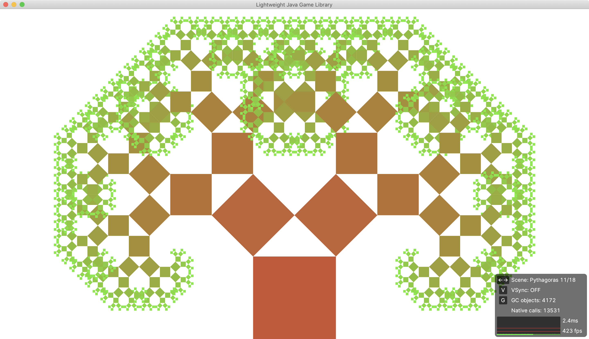
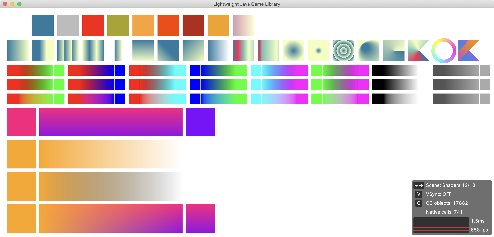
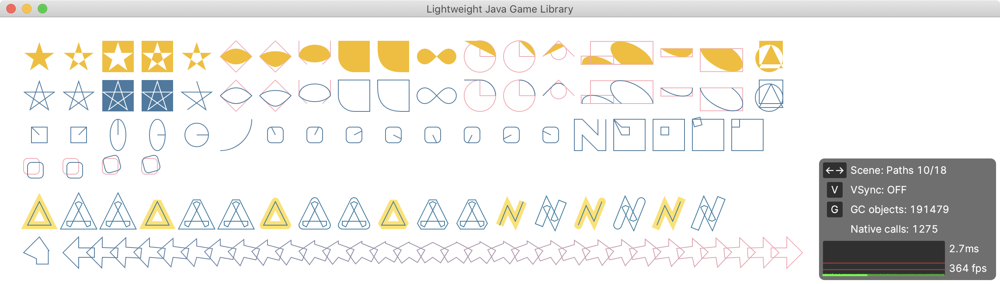

# Skija: Skia bindings for Java


## Current status

Active development. Pre-alpha. Everything will change without notice.

Core progress:

```
Bitmap               ░░░░░░░░░░
Canvas               ▓▓▓▓▓▓░░░░
Color                ▓░░░░░░░░░
ColorFilter          ▓▓▓▓▓▓▓▓▓▓
ColorSpace           ▓▓░░░░░░░░
Data                 ▓▓▓▓▓▓▓▓▓░
Font                 ▓▓░░░░░░░░
FontData             ░░░░░░░░░░
FontManager          ▓▓▓▓▓▓▓▓▓░ 
FontStyle            ▓▓▓▓▓▓▓▓▓▓
FontStyleSet         ▓▓▓▓▓▓▓▓▓▓
Image                ▓▓░░░░░░░░
ImageFilters         ▓▓▓▓▓▓▓▓▓▓
MaskFilter           ▓▓▓▓▓▓▓▓▓▓
Matrix               ▓▓▓░░░░░░░
Paint                ▓▓▓▓▓▓▓▓░░
Path                 ▓▓▓▓▓▓▓▓▓▓
PathEffects          ▓▓▓▓▓▓▓▓▓▓
Picture              ░░░░░░░░░░
PictureRecorder      ░░░░░░░░░░
Region               ▓▓▓▓▓▓▓▓▓▓
ScalerContext        ░░░░░░░░░░
Shader               ▓▓▓▓▓▓▓▓▓▓
Stream               ░░░░░░░░░░
Surface              ▓░░░░░░░░░
TextBlob             ▓▓░░░░░░░░
Typeface             ▓▓▓▓▓▓▓▓░░
```

Paragraph progress:

```
FontCollection       ▓▓▓▓▓▓▓▓▓▓
LineMetrics          ▓▓▓▓▓▓▓▓▓░
Paragraph            ▓▓▓▓▓▓▓▓▓▓
ParagraphCache       ▓▓▓▓▓▓▓▓▓▓
ParagraphStyle       ▓▓▓▓▓▓▓▓▓▓
ParagraphBuilder     ▓▓▓▓▓▓▓▓▓▓
TextStyle            ▓▓▓▓▓▓▓▓▓▓
TypefaceFontProvider ▓▓▓▓▓▓▓▓▓▓
```

## Using

Maven:

```xml
<repositories>
  <repository>
    <id>Bintray</id>
    <url>https://jetbrains.bintray.com/skija</url>
  </repository>
</repositories>

<dependencies>
  <dependency>
    <groupId>org.jetbrains.skija</groupId>
    <artifactId>skija</artifactId>
    <version>0.0.0</version>
  </dependency>
</dependencies>
```

Gradle:

```gradle
repositories {
  maven {
    url "https://jetbrains.bintray.com/skija"
  }
}

dependencies {
  api "org.jetbrains.skija:skija:0.0.0"
}
```

## Checkout

```sh
git clone https://github.com/JetBrains/skija.git
cd skija
```

## Using prebuilt Skia

At the moment Skija is built against `chrome/m84` branch of Skia with `skshaper` and `skparagraph` modules.

Prebuilt Skia can be downloaded from [JetBrains Bintray](https://bintray.com/beta/#/jetbrains/skija/Skia?tab=files).

Download, unpack and set

```
export SKIA_DIR=~/Downloads/Skia_m84-macOS-Release-x64
```

## Building Skia from scratch

Install `depot_tools` somewhere:

```sh
git clone 'https://chromium.googlesource.com/chromium/tools/depot_tools.git'
export PATH="${PWD}/depot_tools:${PATH}"
```

Check out `skia` submodule:

```sh
cd third_party/skia
git submodule update --init
```

Build Skia (macOS):

`gn` and `ninja` requires `python2` for successful work 
So next configuration command would be useful if you have several python distribution installed
```sh
echo 'script_executable = "python2"' >> ./third_party/skia/.gn
```

Patch BUILD.gn to include `skparagraph`:

```sh
( cd third_party/skia && git apply ../skia_skparagraph.patch )
```

```sh
python2 tools/git-sync-deps
gn gen out/Release-x64 --args="is_debug=false is_official_build=true skia_use_system_expat=false skia_use_system_icu=false skia_use_system_libjpeg_turbo=false skia_use_system_libpng=false skia_use_system_libwebp=false skia_use_system_zlib=false skia_use_sfntly=false skia_use_freetype=true skia_use_harfbuzz=true skia_pdf_subset_harfbuzz=true skia_use_system_freetype2=false skia_use_system_harfbuzz=false target_cpu=\"x64\" extra_cflags=[\"-stdlib=libc++\", \"-mmacosx-version-min=10.9\"] extra_cflags_cc=[\"-frtti\"]"
ninja -C out/Release-x64 skia modules
```

## Building Skija

Prerequisites:

- macOS (Windows and Linux planned)
- cmake
- ninja
- JDK 11+ and JAVA_HOME

```sh
./script/build.sh
```

## Running examples

Examples require latest master build of Skija installed locally in `.m2` (see [Building](#building-skija)).

```sh
./script/install.sh
```

GLFW (via LWJGL), Java and Maven:

```sh
cd examples/lwjgl
./script/build.sh && ./script/run.sh
```








JOGL, Kotlin and Gradle:

```sh
cd examples/jogl
./gradlew run
```
